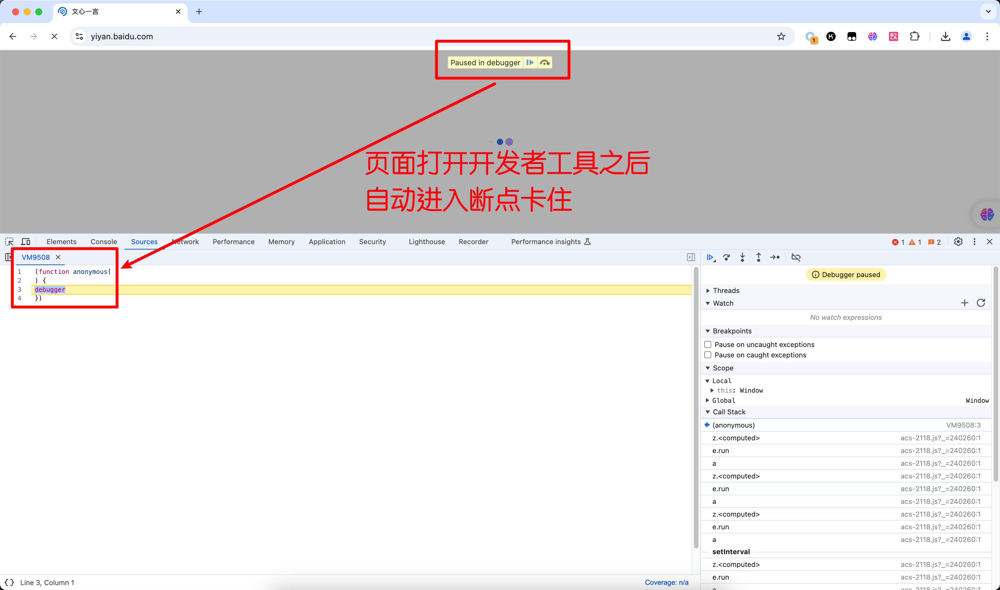
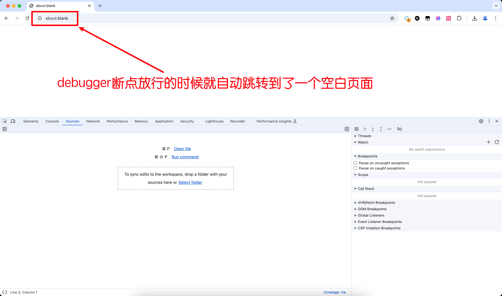
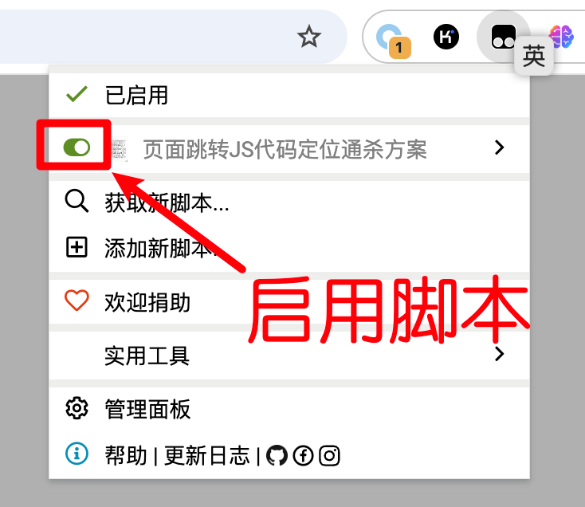
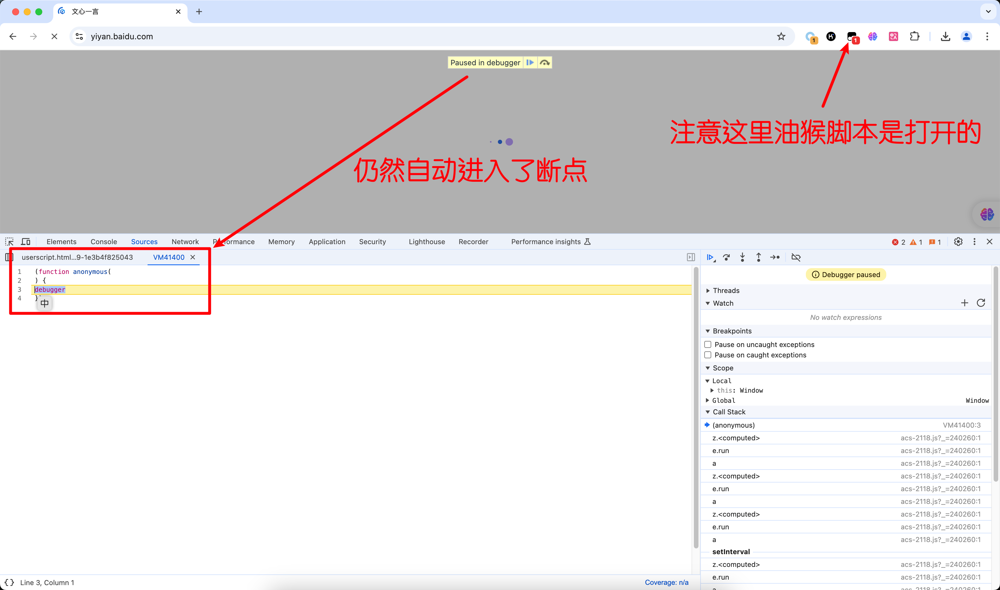
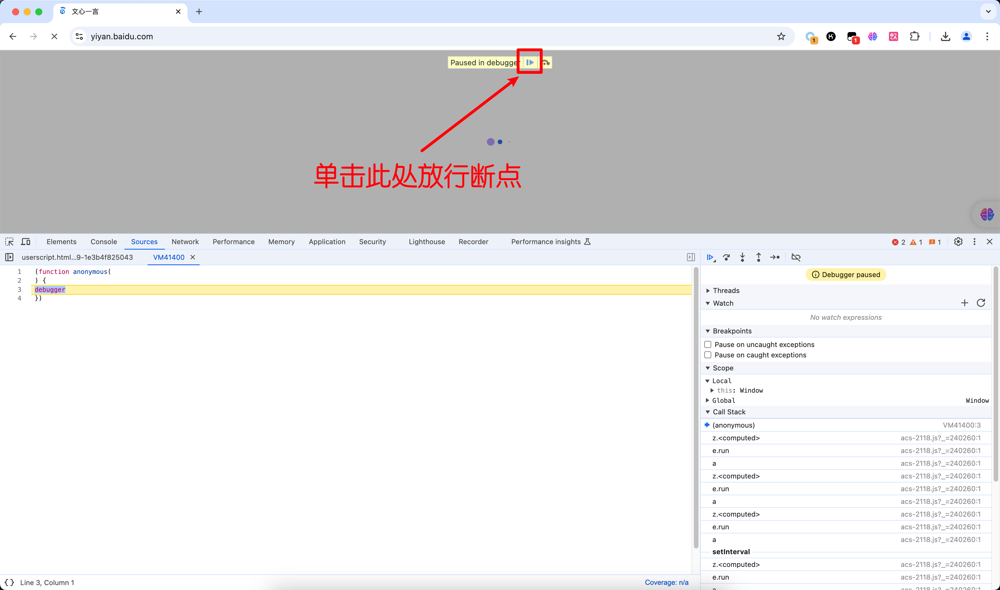
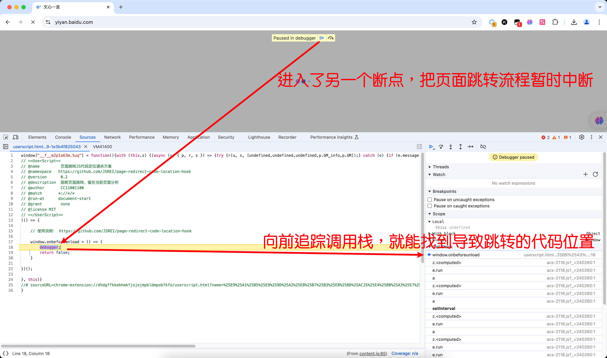
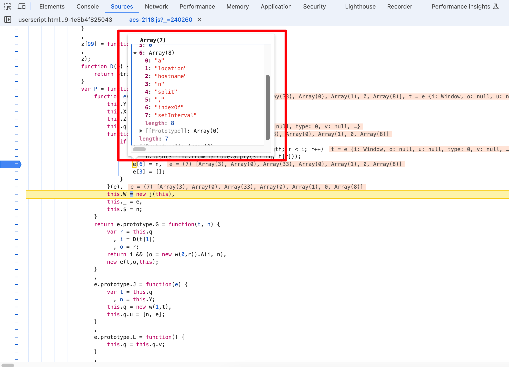

# 文心一言重定向破解分析 

# 一、目标

文心一言的网址：
```text
https://yiyan.baidu.com/
```

打开开发者工具之后，自动进入了debugger断点：



debugger断点放行的时候就自动跳转到了一个空白页面，这里其实就是断点那里进行了一个检测，然后我们被发现了，被识别为可能是恶意用户，于是就自动跳转到了一个空白页面保护自己：




# 二、分析

首先在油猴商店安装页面通杀脚本：

```
https://greasyfork.org/zh-CN/scripts/448502
```

安装完毕之后启动脚本：



然后再次打开文心一言的界面：

```
https://yiyan.baidu.com/
```

再次打开开发者工具，此时和上次一样，仍然会自动进入断点：



然后再次放行断点：



然后这个时候页面会再次被重定向，但是在页面跳转的前一刻，命中了另一个断点，跳转行为被暂时中断了：







```js
                function D(e) {
                    return String.fromCharCode.apply(String, e);
                }
                var P = function() {
                    function e(e, t, n) {
                        this.Y = 0,
                        this.X = [],
                        this.Z = null,
                        this.q = new w(0,t),
                        function(e) {
                            if (e[3].length && 'object' == typeof e[3]) {
                                for (var t = e[3], n = [], r = 0, i = t.length; r < i; r++)
                                    n.push(String.fromCharCode.apply(String, t[r]));
                                e[6] = n,
                                e[3] = [];
                            }
                        }(e),
                        this.W = new j(this),
                        this._ = e,
                        this.$ = n;
                    }
```


